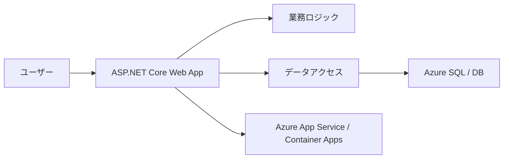

# 概要

このガイドは、ASP.NET Core と Azure を使って **単一デプロイ単位のモダン Web アプリケーション** を設計するための全体像を扱います。

ここでいう「モダン」は、単に新しいフレームワークを使うことではありません。クラウドで動かしやすく、テストしやすく、変更しやすく、必要に応じてスケールできる構造を選ぶことです。

特に重要なのは、最初から大きな分散システムにしない判断です。業務要件が単一アプリで満たせるなら、モノリシックな Web アプリは構築、デプロイ、デバッグ、運用が単純になります。

この備忘録では、原典の章立てに合わせながら、設計判断を次の観点で読み替えます。

| 観点 | 読み方 |
| --- | --- |
| アーキテクチャ | どの構成を選ぶと変更しやすいか |
| ASP.NET Core | フレームワーク機能をどこまで使うか |
| Azure | どのホスティングと運用機能を使うか |
| テスト | どの単位を自動テストで守るか |
| チーム開発 | CI/CD と環境差分をどう管理するか |

このガイドはマイクロサービスの詳細設計ではなく、クラウド対応した ASP.NET Core Web アプリを堅実に作るための設計メモとして読むと理解しやすくなります。
