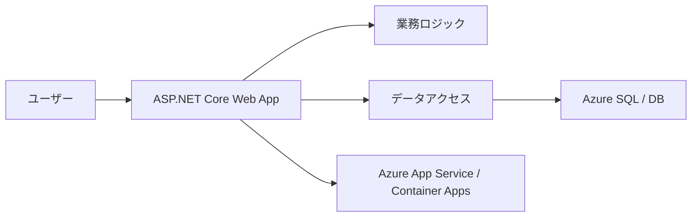

# 概要

このガイドは、ASP.NET Core と Azure を使って **単一デプロイ単位のモダン Web アプリケーション** を設計するための全体像を扱います。

ここでいう「モダン」は、単に新しいフレームワークを使うことではありません。クラウドで動かしやすく、テストしやすく、変更しやすく、必要に応じてスケールできる構造を選ぶことです。

特に重要なのは、最初から大きな分散システムにしない判断です。業務要件が単一アプリで満たせるなら、モノリシックな Web アプリは構築、デプロイ、デバッグ、運用が単純になります。

この備忘録では、原典の章立てに合わせながら、設計判断を次の観点で読み替えます。

| 観点 | 読み方 |
| --- | --- |
| アーキテクチャ | どの構成を選ぶと変更しやすいか |
| ASP.NET Core | フレームワーク機能をどこまで使うか |
| Azure | どのホスティングと運用機能を使うか |
| テスト | どの単位を自動テストで守るか |
| チーム開発 | CI/CD と環境差分をどう管理するか |

読む前に、次の前提があると理解しやすくなります。

| 前提知識 | ざっくり分かっていればよいこと |
| --- | --- |
| HTTP | request / response、status code、form、JSON |
| ASP.NET Core | Controller、Razor Pages、DI、middleware という言葉 |
| データベース | table、transaction、connection string |
| Azure | App Service、Azure SQL、Application Insights の役割 |

全部を先に覚える必要はありません。読んでいて分からない言葉が出たら、この表に戻って「どの分野の話か」を確認すれば十分です。

このガイドはマイクロサービスの詳細設計ではなく、クラウド対応した ASP.NET Core Web アプリを堅実に作るための設計メモとして読むと理解しやすくなります。

## このページで覚えること

- モダン Web アプリは、新しい技術を使うことではなく、変更、テスト、運用に耐える構造を選ぶこと。
- 単一アプリで十分な間は、無理にマイクロサービス化しない。
- ASP.NET Core と Azure は、単一デプロイ単位でもクラウド対応しやすい。
