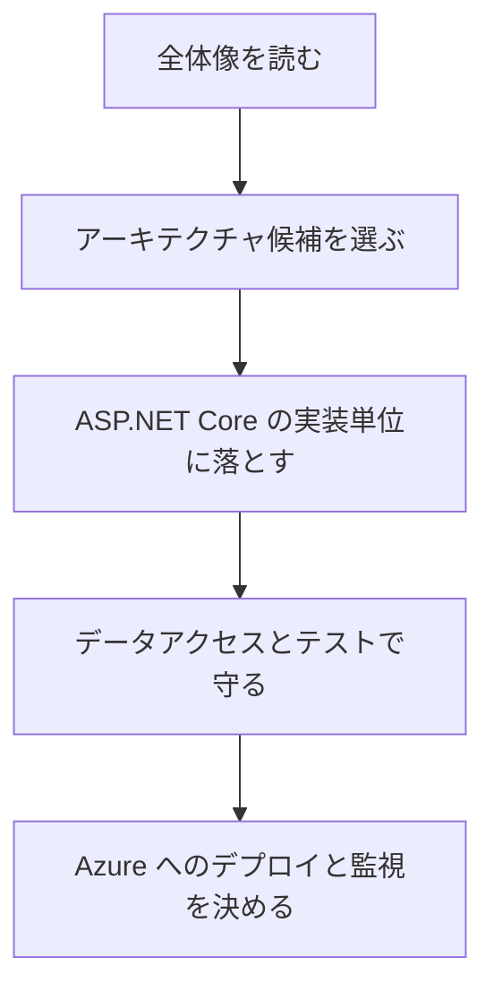

# 対象読者と使い方

このガイドの主な対象は、ASP.NET Core と Azure で Web アプリを設計、実装、移行する開発者、開発リード、アーキテクトです。

特に次のような場面で読み返すと効果があります。

- 新規の ASP.NET Core Web アプリをどの構成で始めるか決めたい。
- 既存 ASP.NET / .NET Framework アプリを ASP.NET Core へ移行するか判断したい。
- MVC、Razor Pages、SPA、Blazor、Web API の境界を整理したい。
- Azure App Service や Container Apps へ載せる前提で、CI/CD と監視を設計したい。
- Clean Architecture や DDD を導入する前に、依存方向と責務分離を確認したい。

読み方としては、最初に全体を通して読み、次に設計中の論点に近い章を戻って読むのが向いています。

サンプルアプリとして紹介される eShopOnWeb は、設計パターンを確認するための参照実装です。現実の EC サイト機能を網羅するものではなく、依存関係の向き、プロジェクト分割、テスト、データアクセスの例として読むのがよいです。
