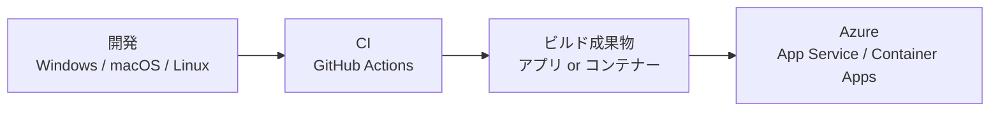

# クラウドとクロスプラットフォーム

クラウド向けの Web アプリでは、サーバーを固定資産として考えるより、必要なときに必要なリソースを使う前提で考えます。

ASP.NET Core は低メモリで高スループットな実行を目指しており、同じリソース上でより多くの要求を処理しやすくなります。これは Azure App Service、Container Apps、Kubernetes、VM のいずれに載せる場合でも意味があります。

クロスプラットフォームであることも重要です。開発環境を Windows に限定せず、Linux コンテナーで運用し、CI/CD では Ubuntu runner でビルドする、といった構成が取りやすくなります。

実務では、最初から「コンテナーにするか」だけで考えない方がよいです。App Service の zip deploy で十分なこともありますし、実行環境を統一したい、依存ライブラリが多い、将来 Container Apps / AKS へ移したい場合はコンテナーが有効になります。
