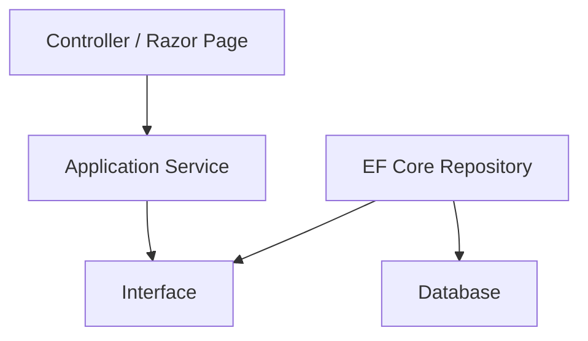

# モジュール性と疎結合

ASP.NET Core は、必要な機能を NuGet パッケージとして組み合わせて使う設計です。これは、アプリケーションが使わない機能まで抱え込まなくてよいという利点があります。

疎結合の中心になるのは DI です。Controller、PageModel、Service、Repository などが具象実装に直接依存せず、インターフェイスや抽象に依存することで、差し替えとテストが容易になります。

ただし、すべてをインターフェイス化すればよいわけではありません。差し替え予定がない単純なクラスまで抽象化すると、読む量だけが増えます。判断基準は、テストで置き換えたいか、インフラ実装を隠したいか、複数実装があり得るかです。

疎結合は「どこが変わりやすいか」を見て導入します。UI、外部サービス、データベース、時刻、ファイルシステム、メール送信などは変化やテストの都合で切り離す価値が高い領域です。
