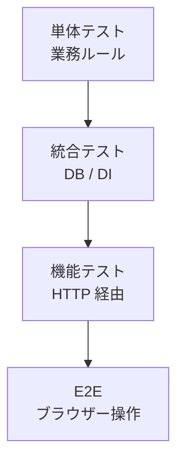

# テスト容易性

ASP.NET Core アプリは、単体テスト、統合テスト、機能テストを段階的に書きやすい構造を取れます。

単体テストでは、業務ロジックを HTTP や DB から切り離して検証します。DI を使って外部依存を差し替えられるようにしておくと、テストが速く安定します。

統合テストや機能テストでは、`WebApplicationFactory` や `TestServer` を使って、実際の middleware、routing、model binding、filters を通した検証ができます。これは、Controller の戻り値だけを確認するより、本番に近い経路を守れます。

テスト容易性は後から足すものではなく、アーキテクチャの結果です。Controller に DB アクセス、業務判断、外部 API 呼び出しが混ざっていると、テストは重くなります。責務を分けることは、保守性だけでなくテストの速度と信頼性にも効きます。
