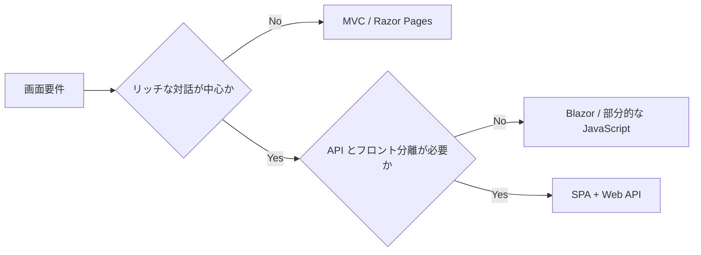

# 概要

Web アプリの UI 構成は、大きく従来型 Web アプリ、SPA、ハイブリッドに分けられます。

従来型 Web アプリは、サーバーが画面を生成し、リクエストごとに HTML を返します。SPA は、ブラウザー上の JavaScript / TypeScript / WebAssembly アプリが UI を担当し、サーバーとは主に Web API で通信します。

選択の中心は、ユーザー体験、チームスキル、SEO、開発と運用の複雑さです。

この章では、どちらが新しいかではなく、どちらがアプリとチームに合うかで判断します。
