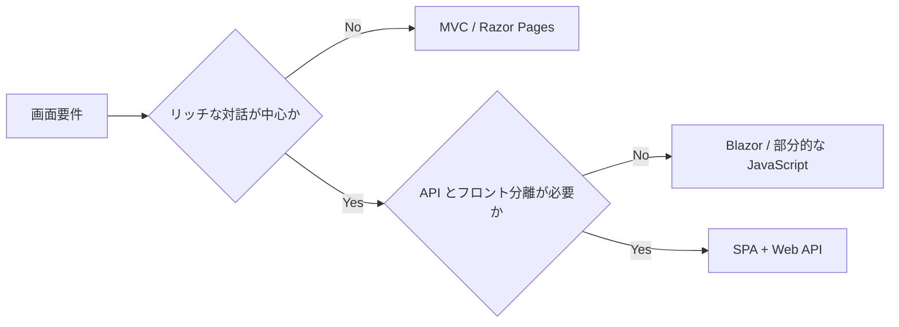

# 概要

Web アプリの UI 構成は、大きく従来型 Web アプリ、SPA、ハイブリッドに分けられます。

従来型 Web アプリは、サーバーが画面を生成し、リクエストごとに HTML を返します。SPA は、ブラウザー上の JavaScript / TypeScript / WebAssembly アプリが UI を担当し、サーバーとは主に Web API で通信します。

選択の中心は、ユーザー体験、チームスキル、SEO、開発と運用の複雑さです。

最初の判断は、次の表で十分です。

| 条件 | 向いている構成 |
| --- | --- |
| 管理画面や社内業務アプリが中心 | MVC / Razor Pages |
| 画面が単純で、認証やフォーム処理が中心 | MVC / Razor Pages |
| SEO が重要 | MVC / Razor Pages、または SSR 対応フロントエンド |
| 画面操作が多く、API 分離したい | SPA + Web API |
| C# 中心でリッチ UI を作りたい | Blazor |
| まず小さく始めたい | MVC / Razor Pages |

画面が単純な業務アプリでは、SPA にすると API、認証、状態管理、ビルドの設計が増え、かえって複雑になることがあります。

この章では、どちらが新しいかではなく、どちらがアプリとチームに合うかで判断します。

## このページで覚えること

- UI 構成は、新しさではなく要件とチームに合わせて選ぶ。
- 小さく始めたいなら MVC / Razor Pages が扱いやすい。
- SPA はリッチ UI に強いが、認証、CORS、状態管理、ビルドなどの設計も増える。
