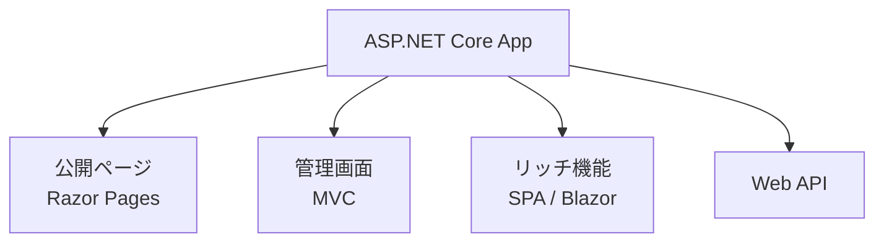

# Blazor とハイブリッド構成

Blazor は、C# と Razor で対話的 UI を作るための選択肢です。JavaScript SPA とは違い、.NET 開発者が同じ言語と型システムを使って UI を構築しやすい点が特徴です。

Blazor Server はサーバー側で UI 状態を保持し、SignalR 接続でブラウザーへ差分を送ります。初期ロードが軽く、サーバー側資産を使いやすい一方、常時接続とレイテンシの影響を受けます。

Blazor WebAssembly はブラウザーで .NET を実行します。SPA として振る舞えますが、初回ロードサイズや API 設計、認証設計を考える必要があります。

実務ではハイブリッド構成がよく効きます。

アプリ全体を一つの方式に統一するより、ユーザー体験やチームの得意領域に合わせて部分的に選ぶ方が保守しやすいことがあります。
