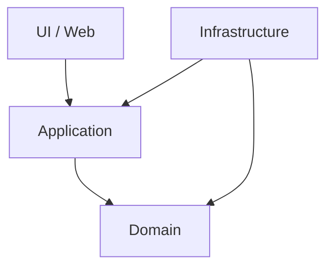

# 概要

アーキテクチャの原則は、コードの置き場所やクラス名より前に、変更しやすさを守るための考え方です。

この章で重要なのは、関心の分離、単一責任、依存関係の反転、明示的依存関係、永続化非依存、境界づけられたコンテキストです。

これらは独立した標語ではなく、同じ方向を向いています。つまり、**業務上重要なルールを、UI や DB や外部サービスの都合から守る** ということです。

依存方向を意識すると、どこをテストし、どこを差し替え、どこに業務判断を書くべきかが見えやすくなります。
