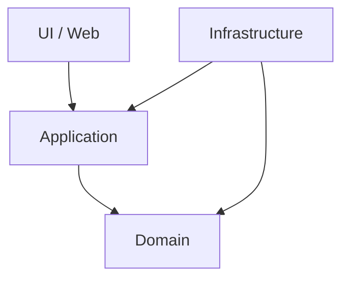

# 概要

アーキテクチャの原則は、コードの置き場所やクラス名より前に、変更しやすさを守るための考え方です。

この章で重要なのは、関心の分離、単一責任、依存関係の反転、明示的依存関係、永続化非依存、境界づけられたコンテキストです。

用語だけ見ると難しく見えますが、ASP.NET Core のコードに置き換えると次のようになります。

| 原則 | ざっくり言うと | ASP.NET Core での例 |
| --- | --- | --- |
| 関心の分離 | 役割ごとにコードを分ける | Controller に SQL を書かない |
| 単一責任 | 1 つのクラスに複数の仕事を持たせない | `UserService` にメール送信まで詰め込まない |
| 依存関係の反転 | 業務ロジックを DB や外部 API に直接依存させない | interface 経由で Repository を呼ぶ |
| 明示的依存関係 | 必要なものを constructor で見えるようにする | `IClock` や `IEmailSender` を DI で受け取る |
| 永続化非依存 | 業務ルールを DB 保存方法から切り離す | Entity の判断を `DbContext` なしでテストできる |
| 境界づけられたコンテキスト | モデルが有効な範囲を分ける | 販売の `Order` と請求の `Order` を無理に共通化しない |

これらは独立した標語ではなく、同じ方向を向いています。つまり、**業務上重要なルールを、UI や DB や外部サービスの都合から守る** ということです。

依存方向を意識すると、どこをテストし、どこを差し替え、どこに業務判断を書くべきかが見えやすくなります。

## このページで覚えること

- アーキテクチャ原則は、業務ルールを UI、DB、外部サービスの都合から守るために使う。
- まずは Controller に業務ルールや SQL を詰め込まないことから始める。
- 抽象化は目的ではなく、変更やテストで困る場所を切り離すための手段。
