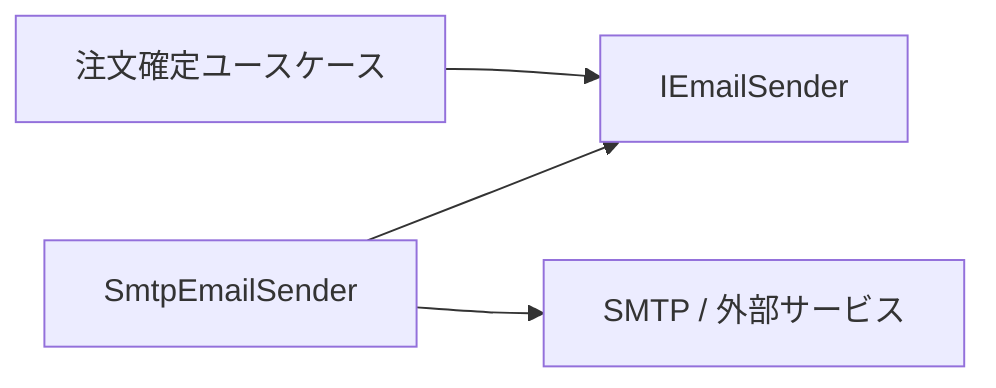

# 依存関係の反転と明示的依存関係

依存関係の反転は、上位の業務ルールが下位の実装詳細に直接依存しないようにする原則です。

典型例は、Application 層が `EmailSender` の具象実装ではなく `IEmailSender` に依存し、Infrastructure 層がその実装を提供する形です。

明示的依存関係の原則は、クラスが必要とするものをコンストラクターなどで明示する考え方です。内部で `new` したり、グローバル状態から取り出したりすると、そのクラスを読むまで依存が分かりません。

ASP.NET Core の DI は、この原則を実装しやすくします。依存がコンストラクターに現れるため、テスト時には fake / mock 実装へ差し替えられます。

ただし、依存関係の反転は「何でもインターフェイスにする」ことではありません。外部境界、永続化、時刻、乱数、メール、HTTP クライアントなど、実装詳細や副作用を持つものに優先して使います。
