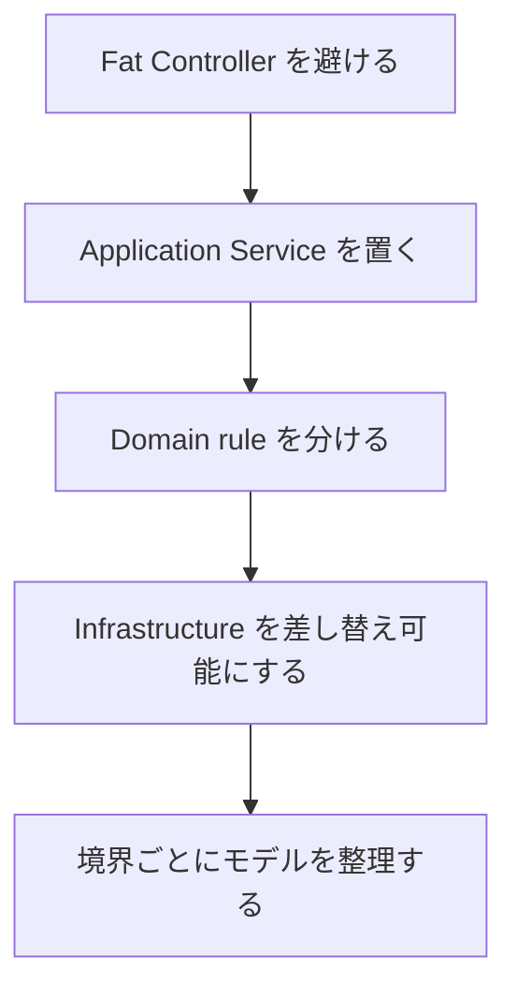

# 原則を適用する順番

アーキテクチャ原則は、最初からすべてを重く適用する必要はありません。実務では、リスクが高いところから使うのが現実的です。

おすすめの順番は次の通りです。

1. Controller / PageModel に業務ロジックを置きすぎない。
2. DB や外部サービス呼び出しを Application / Infrastructure 側へ寄せる。
3. テストしたい業務ルールを副作用から切り離す。
4. 変更が多い外部境界にインターフェイスを置く。
5. モデルが大きくなったら境界づけられたコンテキストを分ける。

原則を守る目的は、きれいな図を作ることではなく、変更を安全にすることです。コードを読む人が「この判断はどこにあるか」を予測できる状態を目指します。
