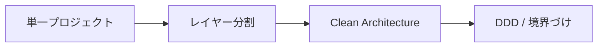

# 概要

Web アプリケーションのアーキテクチャは、最初は単純でよく、複雑さに応じて分離を増やします。

原典では、単一プロジェクト、レイヤードアーキテクチャ、Clean Architecture、DDD を含む構成が紹介されます。重要なのは、どれが正解かではなく、アプリの規模、変更頻度、テスト対象、チームの理解度に合わせて選ぶことです。

最初から Clean Architecture や DDD を全部入れる必要はありません。小さいアプリでは、過剰な分離は理解コストになります。

ただし、あとで分離しやすくするために、Controller に業務ルールを詰め込まない、DB アクセスを画面処理に混ぜない、といった最低限の境界は最初から意識します。

設計が重くなるほど、責務は明確になりますが、ファイル数、抽象、初期学習コストも増えます。最初から最終形を作るより、依存方向を守りながら成長できる構造にするのが現実的です。

| 状態 | 例 | 起きやすい問題 |
| --- | --- | --- |
| 過剰設計 | 単純 CRUD に Repository、Unit of Work、Domain Event を全部入れる | 読むファイルが増え、変更が遅くなる |
| 不足設計 | Controller に validation、料金計算、SQL、メール送信を全部書く | テストしづらく、変更の影響範囲が読めない |
| ちょうどよい設計 | Controller は薄くし、業務判断と DB 処理を分ける | 後から Application / Domain を分離しやすい |

## このページで覚えること

- 小さいアプリでは、最初から重いアーキテクチャを入れなくてよい。
- ただし Controller と DB に業務ルールを散らさない。
- アーキテクチャは、今の複雑さと将来の変更しやすさのバランスで選ぶ。
