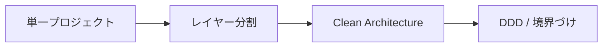

# 概要

Web アプリケーションのアーキテクチャは、最初は単純でよく、複雑さに応じて分離を増やします。

原典では、単一プロジェクト、レイヤードアーキテクチャ、Clean Architecture、DDD を含む構成が紹介されます。重要なのは、どれが正解かではなく、アプリの規模、変更頻度、テスト対象、チームの理解度に合わせて選ぶことです。

設計が重くなるほど、責務は明確になりますが、ファイル数、抽象、初期学習コストも増えます。最初から最終形を作るより、依存方向を守りながら成長できる構造にするのが現実的です。
