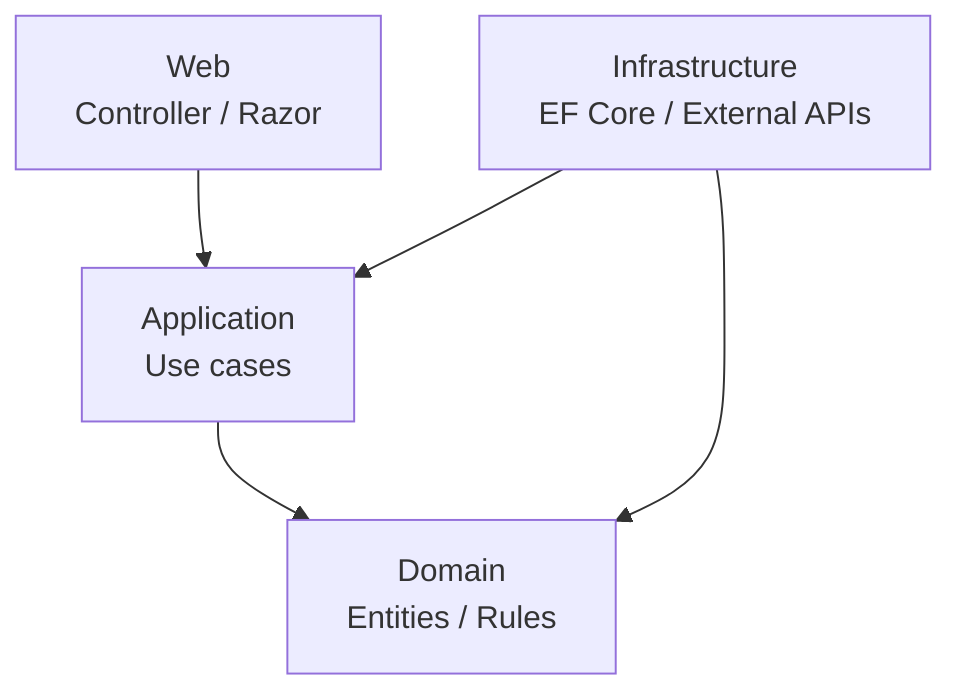

# Clean Architecture

Clean Architecture は、業務ルールを中心に置き、外側の UI や DB やフレームワーク詳細へ依存しないようにする構成です。

中心に Domain、次に Application、外側に Infrastructure と Web を置くと考えると分かりやすいです。

この構成では、Application 層が必要な外部機能をインターフェイスとして定義し、Infrastructure 層が実装します。これにより、業務ロジックは DB やメール送信の具象実装から切り離されます。

Clean Architecture が有効なのは、業務ルールが複雑で、長く保守し、テストで守りたいアプリです。単純な CRUD 中心の小規模アプリでは、抽象が増えすぎることがあります。

導入するなら、最初にプロジェクト分割だけを真似るのではなく、「Domain / Application が Infrastructure を参照しない」ことを守ります。
