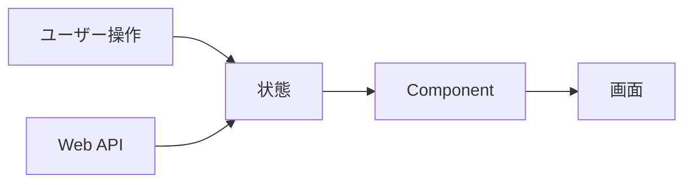

# SPA フレームワーク

SPA フレームワークは、UI を component と状態の組み合わせとして構築します。

jQuery が DOM を直接操作するのに対して、React や Angular では「状態がこうなら UI はこうなる」という宣言的な形で書けます。状態変更に応じて DOM 更新を framework が担当します。

SPA の利点は、複雑な UI を部品化して作りやすいことです。一方で、routing、state management、API client、認証、build、test、bundle optimization などの設計が必要です。

Angular は framework として一式を提供する傾向が強く、React は library として周辺選択肢を組み合わせる傾向があります。どちらがよいかは、チームの経験と標準化したい範囲で変わります。
