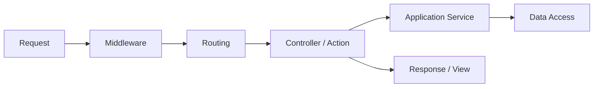

# 概要

ASP.NET Core MVC アプリの開発では、HTTP request が middleware、routing、controller、model binding、validation、filter、view / response を通って処理されます。

この章は、アプリを作るときに「どの処理をどこへ置くか」を理解するための中心です。



Controller は入口であり、業務ロジックの置き場ではありません。入力を受け取り、ユースケースを呼び出し、結果を HTTP / View に変換する役割に寄せると保守しやすくなります。

悪い例は、Controller が処理を抱え込みすぎる形です。

- Controller で料金計算をする。
- Controller で在庫数を直接更新する。
- Controller でメール送信、DB 更新、ログ出力を全部行う。

良い例は、Controller を薄くして、ユースケースを Application Service に任せる形です。

- Controller は入力を受け取る。
- Application Service にユースケースを任せる。
- 結果を ViewModel や HTTP response に変換する。

```csharp
public async Task<IActionResult> Checkout(CheckoutRequest request)
{
    var result = await checkoutService.CheckoutAsync(request);

    return result.IsSuccess
        ? RedirectToAction("Complete")
        : View("Error", result);
}
```

この例では、`Checkout` action は注文確定の細かい判断を持ちません。request を受け取り、`checkoutService` に任せ、画面遷移だけを決めています。

## このページで覚えること

- Controller は HTTP の入口であり、業務ロジックの置き場ではない。
- 業務判断は Application Service や Domain 側に寄せる。
- Controller を薄くすると、テストしやすく、画面変更の影響も追いやすい。
