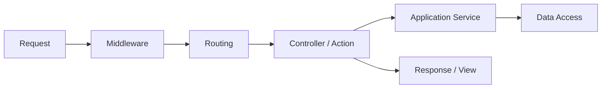

# 概要

ASP.NET Core MVC アプリの開発では、HTTP request が middleware、routing、controller、model binding、validation、filter、view / response を通って処理されます。

この章は、アプリを作るときに「どの処理をどこへ置くか」を理解するための中心です。

Controller は入口であり、業務ロジックの置き場ではありません。入力を受け取り、ユースケースを呼び出し、結果を HTTP / View に変換する役割に寄せると保守しやすくなります。
