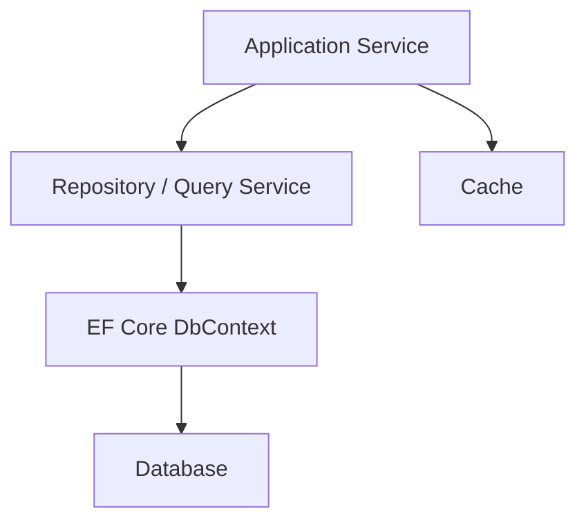

# 概要

ASP.NET Core アプリのデータ操作では、EF Core、Repository、Specification、キャッシュ、接続復元性、トランザクションをどう扱うかが中心になります。

データアクセスはアプリの変更容易性と性能に強く影響します。単純な CRUD では `DbContext` を直接使っても十分なことがありますが、業務ルールが増えると、永続化の詳細を Application / Domain から切り離したくなります。

この章では、データアクセスを「どこに何を書くか」と「どこまで抽象化するか」で整理します。

最初の判断は、`DbContext` を直接使ってよいか、Repository で隠すかです。

| 条件 | 向いている方法 |
| --- | --- |
| 単純な CRUD が中心 | Application Service から `DbContext` を使う |
| Controller に LINQ が増えてきた | Service / Query Service に移す |
| 業務ルールが複雑 | Repository 経由で永続化詳細を隠す |
| テストで DB 実装を差し替えたい | interface + Repository を使う |
| 複雑な検索条件を再利用したい | Specification / Query Object を使う |

`DbContext` 直利用が悪いわけではありません。問題になるのは、画面処理、業務判断、DB query が同じ場所に混ざって、変更理由が読めなくなることです。

## このページで覚えること

- EF Core の `DbContext` は強力なので、単純な CRUD では直接使ってもよい。
- Repository は、永続化詳細を隠したい理由があるときに使う。
- データアクセスの設計では、抽象化の有無より「業務判断と DB 処理が混ざっていないか」を見る。
