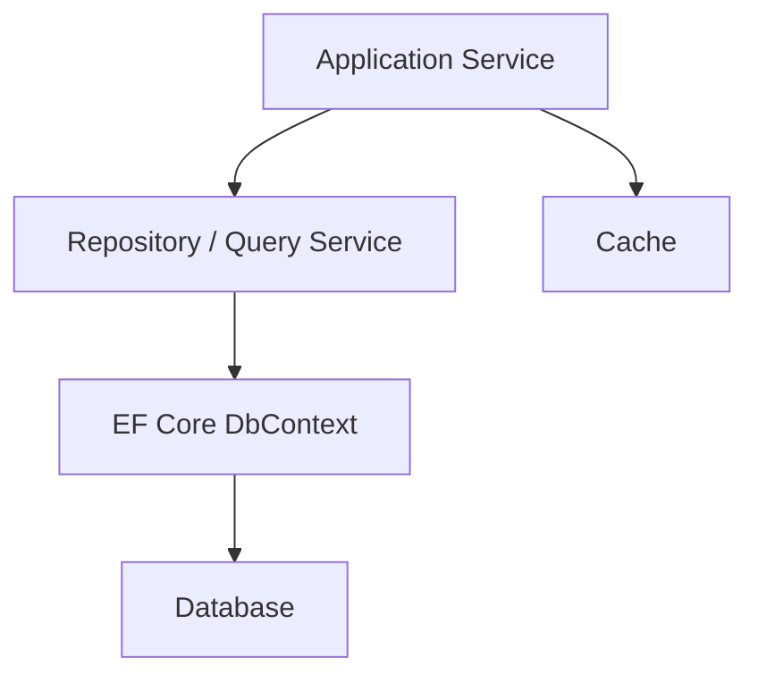

# 概要

ASP.NET Core アプリのデータ操作では、EF Core、Repository、Specification、キャッシュ、接続復元性、トランザクションをどう扱うかが中心になります。

データアクセスはアプリの変更容易性と性能に強く影響します。単純な CRUD では `DbContext` を直接使っても十分なことがありますが、業務ルールが増えると、永続化の詳細を Application / Domain から切り離したくなります。

この章では、データアクセスを「どこに何を書くか」と「どこまで抽象化するか」で整理します。
