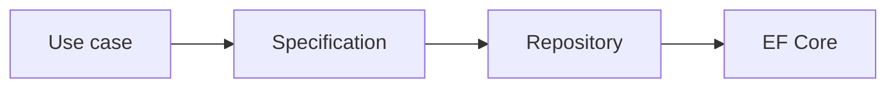

# Repository と Specification

Repository は、データアクセスの詳細を隠し、Application / Domain から永続化の実装を切り離すために使われます。

ただし、EF Core の `DbContext` 自体が Repository 的な機能を持つため、単純な CRUD で機械的に Repository を作ると、薄いラッパーが増えるだけになることがあります。

Repository が有効なのは次のような場面です。

- Domain / Application を EF Core に依存させたくない。
- 集約単位で保存ルールを守りたい。
- テストでデータアクセスを差し替えたい。
- 複雑な query を再利用したい。

Specification は、検索条件や Include などの query 仕様をオブジェクトとして表すパターンです。

Repository と Specification は、複雑さを隠すための道具です。単純な問い合わせまで全て抽象化すると逆に読みにくくなるため、境界の意味があるところに使います。
