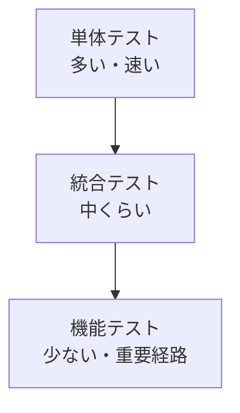

# 概要

ASP.NET Core MVC アプリのテストでは、単体テスト、統合テスト、機能テストを使い分けます。

目的は、すべてをブラウザーから検証することではありません。速く壊れやすい部分は単体で守り、framework や DB との接続は統合テストで守り、重要なユーザー経路だけ機能テストで守ります。

テスト戦略はアーキテクチャとセットです。業務ルールが Controller や EF Core に密結合していると、単体テストが難しくなり、遅いテストに寄りがちです。

何をどのテストで守るかは、次のように考えます。

| テスト種別 | 例 | 目的 |
| --- | --- | --- |
| 単体テスト | 料金計算、注文可能条件、権限判定 | 業務ルールを速く確認する |
| 統合テスト | EF Core の query、Repository、DB 制約 | DB や DI との接続を確認する |
| 機能テスト | `/checkout` に POST して結果を確認 | routing、model binding、filter、response をまとめて確認する |
| E2E | ブラウザーでログインから注文完了まで操作 | 重要なユーザー経路だけ確認する |

すべてを E2E で確認すると遅く壊れやすくなります。逆に単体テストだけでは、routing や認証設定のミスを見逃します。

## このページで覚えること

- テストは役割ごとに分ける。業務ルールは単体、DB 接続は統合、HTTP 経路は機能テストで守る。
- 重要なユーザー経路だけ E2E で確認する。
- テストしやすい構造にするには、Controller や EF Core に業務ルールを密結合させない。
