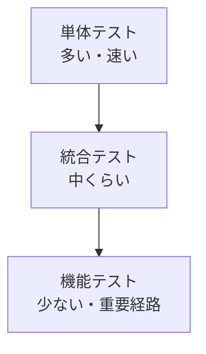

# 概要

ASP.NET Core MVC アプリのテストでは、単体テスト、統合テスト、機能テストを使い分けます。

目的は、すべてをブラウザーから検証することではありません。速く壊れやすい部分は単体で守り、framework や DB との接続は統合テストで守り、重要なユーザー経路だけ機能テストで守ります。

テスト戦略はアーキテクチャとセットです。業務ルールが Controller や EF Core に密結合していると、単体テストが難しくなり、遅いテストに寄りがちです。
