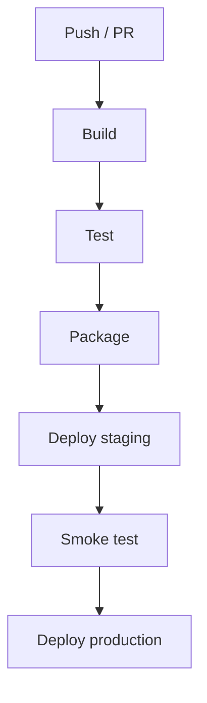

# CI と CD

CI は、共有リポジトリに変更が入るたびにビルドとテストを実行し、デプロイ可能かを早く確認する仕組みです。

CD は、ビルド済み成果物を環境へ反映する仕組みです。Azure App Service へ直接デプロイする、コンテナーイメージを registry に push して Container Apps へ反映する、slot swap を使うなどの方法があります。

CI/CD で最低限確認したいことは次の通りです。

- restore / install が再現できる。
- build が通る。
- 自動テストが通る。
- 成果物が生成される。
- 環境ごとの secret をコードに含めない。
- デプロイ後の health check を確認する。

最初は simple な pipeline でよく、手作業を減らすことが第一歩です。
