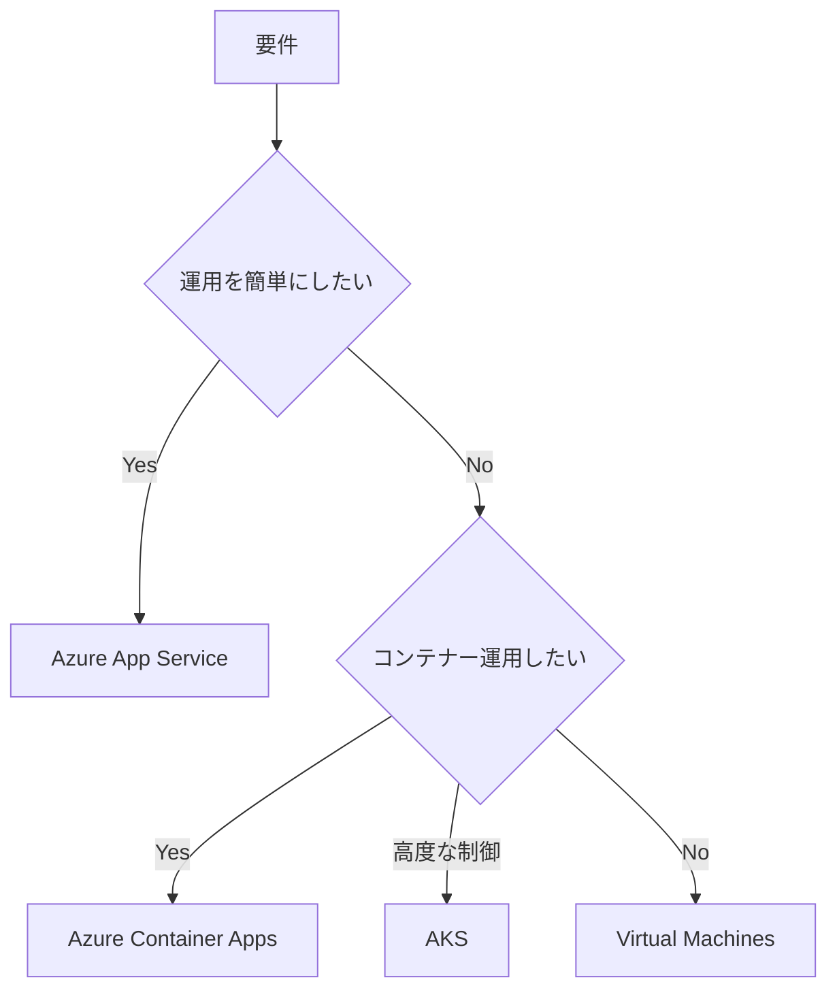

# 概要

ASP.NET Core Web アプリを Azure でホストする選択肢には、Azure App Service、Azure Container Apps、Azure Kubernetes Service、Virtual Machines などがあります。

多くの Web アプリでは、まず Azure App Service が候補になります。管理が容易で、スケール、slot、TLS、custom domain、認証、ログ、監視と統合しやすいからです。

ホスティング選択では、アプリの実行方式だけでなく、DB、secret、network、監視、スケール、コストも合わせて考えます。

最初の判断は、運用の複雑さをどこまで引き受けるかです。

| 条件 | 向いているホスティング |
| --- | --- |
| 一般的な Web アプリを簡単に運用したい | Azure App Service |
| コンテナーで配布したいが Kubernetes は重い | Azure Container Apps |
| Kubernetes の高度な制御が必要 | Azure Kubernetes Service |
| OS やミドルウェアを細かく管理したい | Virtual Machines |
| まず小さく公開したい | Azure App Service |

## このページで覚えること

- 多くの ASP.NET Core Web アプリでは、まず Azure App Service を候補にする。
- コンテナーが必要でも、すぐ AKS にする必要はなく、Container Apps も選択肢になる。
- ホスティングはアプリ本体だけでなく、DB、secret、network、監視、コストとセットで決める。
