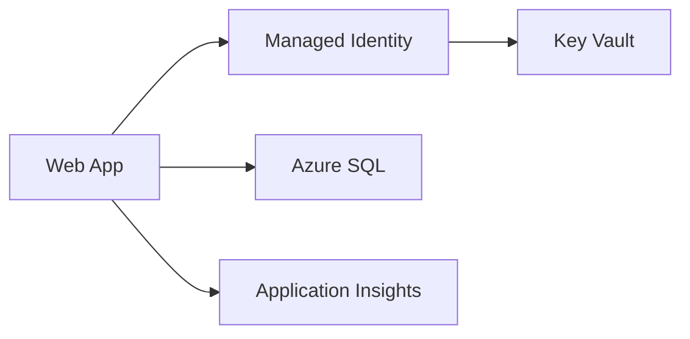

# DB と Secret とネットワーク

Web アプリのホスティングでは、アプリ本体だけでなく周辺サービスも設計します。

DB には Azure SQL Database、Azure Database for PostgreSQL、Cosmos DB などの選択肢があります。既存の EF Core と relational model を使うなら Azure SQL や PostgreSQL が自然です。

Secret はコードや `appsettings.json` に入れません。App Service settings、Key Vault、managed identity を組み合わせて扱います。

ネットワークでは、公開範囲、DB firewall、private endpoint、VNet integration を考えます。最初は単純な公開 Web アプリでも、業務データを扱うなら DB へのアクセス制御と secret 管理は早めに整えます。
